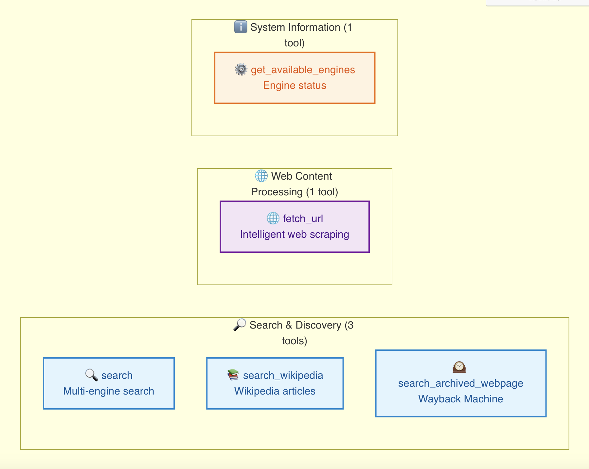

# 🔍 Search Fusion MCP Server

[](https://opensource.org/licenses/MIT)
[](https://www.python.org/downloads/)
[](https://github.com/jlowin/fastmcp)

**🌏 [中文文档](README_zh.md)**

A **High-Availability Multi-Engine Search Aggregation MCP Server** providing intelligent failover, unified API, and LLM-optimized content processing. Search Fusion integrates multiple search engines with smart priority-based routing and automatic failover mechanisms.

## ✨ Features

### 🔄 Multi-Engine Integration
- **Google Search** - Premium performance with API key
- **Serper Search** - Google search alternative with advanced features
- **Jina AI Search** - AI-powered search with intelligent content processing
- **DuckDuckGo** - Free search, no API key required
- **Exa Search** - AI-powered semantic search
- **Bing Search** - Microsoft search API
- **Baidu Search** - Chinese search engine

### 🚀 Advanced Features
- **Intelligent Failover** - Automatic engine switching on failures or rate limits
- **Priority-Based Routing** - Smart engine selection based on availability and performance
- **Unified Response Format** - Consistent JSON structure across all engines
- **Rate Limiting Protection** - Built-in cooldown mechanisms
- **LLM-Optimized Content** - Advanced web content fetching with pagination support
- **Wikipedia Integration** - Dedicated Wikipedia search tool
- **Wayback Machine** - Historical webpage archive search
- **Environment Variable Configuration** - Pure MCP configuration without config files

### 📊 Monitoring & Analytics
- Real-time engine status monitoring
- Success rate tracking
- Error handling and recovery
- Performance metrics

## 🏗️ Architecture

```
Search Fusion MCP Server
├── 🔧 Configuration Manager     # MCP environment variable handling
├── 🔍 Search Manager           # Multi-engine orchestration
├── 🚀 Engine Implementations   # Individual search engines
│   ├── GoogleSearch            # Google Custom Search
│   ├── SerperSearch           # Serper API
│   ├── JinaSearch             # Jina AI Search
│   ├── DuckDuckGoSearch       # DuckDuckGo
│   ├── ExaSearch              # Exa AI
│   ├── BingSearch             # Bing API
│   └── BaiduSearch            # Baidu API
├── 🛠️ Advanced Fetcher         # Multi-method web scraping
└── 📡 MCP Server              # FastMCP integration
```

## 🚀 Quick Start

### Installation

#### Option 1: Install from PyPI (Recommended)
```bash
pip install search-fusion-mcp
```

#### Option 2: Install from Source
```bash
git clone https://github.com/sailaoda/search-fusion-mcp.git
cd search-fusion-mcp
pip install -e .
```


### MCP Integration

#### Environment Variable Configuration

Search Fusion uses **pure MCP environment variable configuration** without requiring config files.

**MCP Client Configuration (PyPI Installation):**
```json
{
  "mcp": {
    "mcpServers": {
      "search-fusion": {
        "command": "search-fusion-mcp",
        "env": {
          "GOOGLE_API_KEY": "your_google_api_key",
          "GOOGLE_CSE_ID": "your_google_cse_id",
          "SERPER_API_KEY": "your_serper_api_key",
          "JINA_API_KEY": "your_jina_api_key",
          "EXA_API_KEY": "your_exa_api_key",
          "BING_API_KEY": "your_bing_api_key",
          "BAIDU_API_KEY": "your_baidu_api_key",
          "BAIDU_SECRET_KEY": "your_baidu_secret_key"
        }
      }
    }
  }
}
```

**MCP Client Configuration (Source Installation):**
```json
{
  "mcp": {
    "mcpServers": {
      "search-fusion": {
        "command": "python",
        "args": ["-m", "src.main"],
        "cwd": "/path/to/your/search-fusion-mcp",
        "env": {
          "GOOGLE_API_KEY": "your_google_api_key",
          "GOOGLE_CSE_ID": "your_google_cse_id",
          "SERPER_API_KEY": "your_serper_api_key",
          "JINA_API_KEY": "your_jina_api_key",
          "EXA_API_KEY": "your_exa_api_key",
          "BING_API_KEY": "your_bing_api_key",
          "BAIDU_API_KEY": "your_baidu_api_key",
          "BAIDU_SECRET_KEY": "your_baidu_secret_key"
        }
      }
    }
  }
}
```

#### Supported Environment Variables

| Search Engine | Environment Variable | Required | Description | Get API Key |
|--------------|---------------------|----------|-------------|-------------|
| Google | `GOOGLE_API_KEY`<br>`GOOGLE_CSE_ID` | Both needed | Google Custom Search API | [Get API Key](https://developers.google.com/custom-search/v1/introduction) |
| Serper | `SERPER_API_KEY` | API key | Serper Google Search API | [Get API Key](https://serper.dev/) |
| Jina AI | `JINA_API_KEY` | Optional | Jina AI Search API (enhanced features with key) | [Get API Key](https://jina.ai/) |
| Bing | `BING_API_KEY` | API key | Microsoft Bing Search API | [Get API Key](https://www.microsoft.com/en-us/bing/apis/bing-web-search-api) |
| Baidu | `BAIDU_API_KEY`<br>`BAIDU_SECRET_KEY` | Both needed | Baidu Search API | [Get API Key](https://ai.baidu.com/) |
| Exa | `EXA_API_KEY` | API key | Exa AI Search API | [Get API Key](https://exa.ai/) |
| DuckDuckGo | None required | - | Free search, no API key needed | - |

**Alternative Variable Names:**
```bash
# Google
GOOGLE_SEARCH_API_KEY    # Alternative to GOOGLE_API_KEY
GOOGLE_SEARCH_CSE_ID     # Alternative to GOOGLE_CSE_ID

# Serper
SERPER_SEARCH_API_KEY    # Alternative to SERPER_API_KEY

# Others follow similar pattern...
```

### Engine Priority

Search engines are prioritized automatically:
1. **Google Search** (Priority 1) - Premium performance with API key
2. **Serper Search** (Priority 1) - Google alternative with advanced features
3. **Jina AI Search** (Priority 1.5) - AI-powered search with optional API key for advanced features
4. **DuckDuckGo** (Priority 2) - Free, no API key required
5. **Exa Search** (Priority 2) - AI-powered search with API key
6. **Bing Search** (Priority 3) - Microsoft search API
7. **Baidu Search** (Priority 3) - Chinese search engine

## 🛠️ MCP Tools



### 1. `search`
Perform web searches with intelligent engine selection and failover.

**Parameters:**
- `query` (required): Search query terms
- `num_results` (default: 10): Number of results to return
- `engine` (default: "auto"): Engine preference
  - `"auto"`: Automatic engine selection (recommended)
  - `"google"`: Prefer Google Search
  - `"serper"`: Prefer Serper Search
  - `"jina"`: Prefer Jina AI Search
  - `"duckduckgo"`: Prefer DuckDuckGo
  - `"exa"`: Prefer Exa Search
  - `"bing"`: Prefer Bing Search
  - `"baidu"`: Prefer Baidu Search

### 2. `fetch_url`
Fetch and process web content with intelligent pagination and multi-method fallback.

**Parameters:**
- `url` (required): Web URL to fetch
- `use_jina` (default: true): Whether to prioritize Jina Reader for LLM-optimized content
- `with_image_alt` (default: false): Whether to generate alt text for images
- `max_length` (default: 50000): Maximum content length per page (auto-paginate if exceeded)
- `page_number` (default: 1): Retrieve specific page from previously fetched content

**Features:**
- **Intelligent Multi-Method Fallback**: Tries Jina Reader → Serper Scrape → Direct HTTP
- **Automatic Pagination**: Splits large content into manageable pages
- **Concurrent-Safe Caching**: Unique page IDs prevent conflicts in high-concurrency scenarios
- **LLM-Optimized Content**: Clean markdown format optimized for AI processing

### 3. `get_available_engines`
Get current status and availability of all search engines.

### 4. `search_wikipedia`
Search Wikipedia articles for entities, people, places, concepts, etc.

**Parameters:**
- `entity` (required): Entity to search for
- `first_sentences` (default: 10): Number of sentences to return (0 for full content)

### 5. `search_archived_webpage`
Search archived versions of websites using Wayback Machine.

**Parameters:**
- `url` (required): Website URL to search
- `year` (optional): Target year
- `month` (optional): Target month
- `day` (optional): Target day


## 📖 API Examples

### Basic Search
```python
# Automatic engine selection
result = await search("artificial intelligence trends 2024")

# Prefer specific engine
result = await search("machine learning", engine="google")
```

### Advanced Web Fetching
```python
# Fetch with intelligent pagination
result = await fetch_url("https://example.com/long-article")

# If content is paginated, get additional pages
if result.get("is_paginated"):
    page_2 = await get_page(result["page_id"], 2)
```

### Wikipedia Search
```python
# Get Wikipedia summary
result = await search_wikipedia("Python programming language")

# Get full article
result = await search_wikipedia("Quantum computing", first_sentences=0)
```

## 🧪 Development

### Development Setup
```bash
git clone https://github.com/sailaoda/search-fusion-mcp.git
cd search-fusion-mcp
pip install -r requirements.txt
pip install -e .
```

## 📦 Docker Deployment
```bash
# Build image
docker build -t search-fusion-mcp .

# Run container
docker run -p 8000:8000 \
  -e GOOGLE_API_KEY=your_key \
  -e GOOGLE_CSE_ID=your_cse_id \
  search-fusion-mcp
```

## 🔧 Configuration Guide

For detailed configuration instructions, see [MCP_CONFIG_GUIDE.md](MCP_CONFIG_GUIDE.md).

## 📊 Performance

- **Latency**: Sub-second response times with caching
- **Availability**: 99.9% uptime with intelligent failover
- **Throughput**: Handles concurrent requests efficiently
- **Scalability**: Horizontal scaling support via Docker

## 🤝 Contributing

1. Fork the repository
2. Create a feature branch
3. Make your changes
4. Add tests for new functionality
5. Submit a pull request

## 📄 License

This project is licensed under the MIT License - see the [LICENSE](LICENSE) file for details.

## 🚨 Rate Limiting & Best Practices

- **Google Search**: 100 queries/day (free tier)
- **Serper API**: Varies by plan
- **Jina AI**: Rate limits apply based on subscription
- **DuckDuckGo**: No official limits, but use responsibly
- **Other engines**: Check respective API documentation

Always implement appropriate delays and respect rate limits to ensure sustainable usage.

## 📞 Support

- 📖 [Documentation](https://github.com/sailaoda/search-fusion-mcp)
- 🐛 [Issue Tracker](https://github.com/sailaoda/search-fusion-mcp/issues)
- 💬 [Discussions](https://github.com/sailaoda/search-fusion-mcp/discussions)

---

**Made with ❤️ for the MCP community**